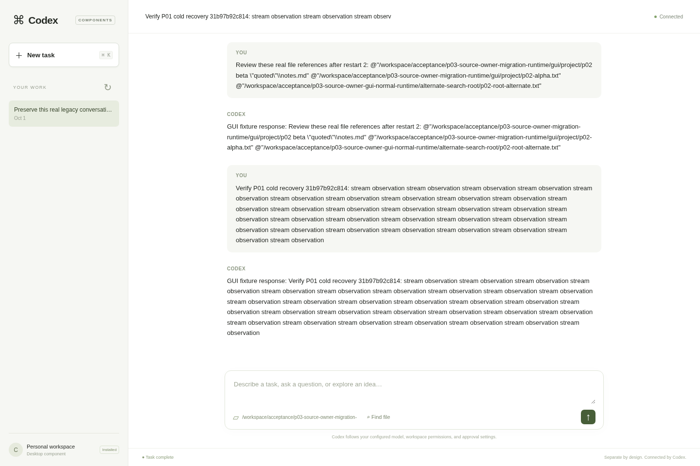

# Project status — Codex Harness Compartmentalized

As of 2026-10-01. This report covers development source `92212516ad4d12bcf60546ee5f879b983ed44682` and the evidence available at that checkpoint. It accompanies the isolated development branch, not a promotion to main.

The project is a working partial platform. Three bounded native functionality families have separately installed runtime proof, and a separately packaged desktop-style GUI works with the real Codex engine. Most of the engine remains coupled. The finished “everything is a plugin” platform, minimal kernel, complete updater and release acceptance have not been achieved.

## What has been established

- Acquired actual Apache-2.0 OpenAI Codex at `d42056091aded7feb1d88ac7e83972108b2aa478`; retained upstream provenance, LICENSE and NOTICE. No Cordis or second harness is required.
- Recovered the original cloud checkout and preserved both saved source worktrees, their Git state, SDK, GUI and verification evidence. The original repository is `DesignStuffDev/codex-harness-everythings-a-plugin`.
- Created checksum-verified recovery archives and published source checkpoints. VM-local archives are local recovery copies; GitHub provides external durability only for included published source. Unfinished work is preserved separately.
- Established component API, process host and adapters, installation/selection/removal, manifest/contract version checks, configuration, initialization, cancellation and shutdown machinery. Generic dependency-broker activation and full upgrade transactions remain incomplete.
- Built a Python SDK wheel, template generator, zipapp packaging, Rust component source/package tools and examples. Recorded acceptance builds packages outside the harness, removes their source and exercises them using unchanged host executables.
- Audited all 169 registered Rust workspace members in the current inventory, plus supporting/staged packages, into 28 functional ownership families. This is inventory coverage, not a count of extracted components.

## Existing native functionality actually separated

| Area | Implemented and independently exercised | Remaining scope |
| --- | --- | --- |
| Local thread persistence | Native LocalThreadStore package, versioned persistent transport, production selection, real session operations/recovery, and selected manual rollout migration. | Auxiliary SQLite domains, backfill, repair/reclamation and every storage maintenance operation are not all extracted. |
| Inline attachment handling | Separate API/native package; byte-preserving upload and the original inline implementation's NotFound resolution. Recorded manager-level proof includes a5MiB upload and package removal. | This implementation stores no durable blobs. Remote upload/routing and comprehensive engine-caller/cancellation proof remain open. |
| Bounded file search | Native search worker installed separately; real CLI, App Server, TUI and GUI consumers; parity, streaming, failure without silent fallback, cancellation and shutdown cases. Older/newer package compatibility has recorded proof. | Private storage search, pending-Open shutdown coverage, all file watching, general filesystem, patching, Git/worktree and import services are not completed by search. |

Primary paths: `codex-rs/thread-store-component`, `thread-store-local-plugin`, `cli/src/migrate_rollouts/runtime.rs`, `attachment-store-api`, `attachment-store-inline`, `attachment-store-component`, `file-search-runtime` and `file-search-local-plugin`. See [the inventory](COMPONENT_INVENTORY.md) for exact owners and evidence.

Model streaming and authentication resolve/refresh have real replacement adapters. Tools, context and lifecycle contributors can add capabilities. These do not establish independent packaging of the complete native model, authentication, context or execution implementations. Native catalog, context reconstruction and newer model/session work also exist in staged form; staged source is not accepted extraction.

## The GUI and headless operation

The desktop presentation plugin contains its own HTML/CSS/JavaScript and Python gateway. It uses the real App Server protocol for saved tasks, user input, streamed assistant/tool output, approvals, interruption and recovery. It includes file-reference search and handles reconnect/history replay. It is our own interface, not the official desktop application's UI source.

Recorded separately packaged GUI tests cover streaming, native shell approval, Stop, reload, cold recovery, continuation, selected storage/search and actual component-manager Launch Ctrl+C. The headless path remains usable with the GUI absent. GUI parity remains incomplete: login, voice/realtime, image attachments, widgets, biometrics and worktree-management flows are not implemented in this client.

This screenshot belongs to the earlier source99 runtime checkpoint and uses a deterministic model fixture. It is not a new screenshot/test of source922. Browser evidence uses cloud Chromium/Playwright. Requested in-app Browser manual testing and live model-provider inference remain unverified.

A user-accessible cloud viewer URL is not established. The original task's current enforced policy still has no additional allowed relay hostname. This separate networking blocker does not block source development, and no public unauthenticated desktop has been exposed by this work.

## Current engineering work

We are in P03: shared lifecycle, transport and dependency authority, after the accepted P01 manual-migration milestone and partial P02 search extraction.

Recent work includes native authentication/workspace-policy, reload/cache/source ownership and installation-ordering checks. Those changes are prerequisites for safe installed authentication/catalog components; native auth, credential persistence/refresh authority and catalog selection are not fully extracted.

A later rebuilt-host regression exposed live Git/HTTPS descendants in two storage runs. Behavior assertions passed, but the unchanged strict process-cleanup runner failed. Those runs remain failures. That is why current work addresses the native curated-plugin background synchronization path before promoting the candidate.

Completed scoped stages on the isolated branch:

1. Bounded Git subprocess output/cleanup with explicit uncertainty.
2. Retained attempt resources: stable lock, child handles, staging/backup directories and worker generation survive uncertain outcomes or unwind. Unknown cleanup stays quarantined; a later reap or restart does not establish recovery.
3. Shared cancellation/deadline control across worker admission, actual file-lock waiting, Git and downstream stage/callback admission. The already-admitted activation/SHA pair completes together.
4. Policy-aware HTTP send/body cancellation, one absolute request deadline, bounded response/diagnostic bodies and original metadata charset/BOM decoding. Client/response/runtime teardown remains on the owned native worker before downstream work.

The newest HTTP stage passed **580/580 focused tests**, zero skipped/retried, and the strict runner exited0 with no drain error. Scoped lint passed with one equivalent test-fixture if-collapse; comment-only and formatting transitions are separately recorded. The original extractor is unchanged. Hidden client/DNS work may prolong ordinary runtime teardown beyond the cancellation deadline.

The next bounded-extraction proposal is frozen and statically reviewed against source922: three files, five proposed tests. Its manifest is `d76bf2389695619fd051ffd24758ba43346e51977dc7115c98d568e863d7ef09` in `p03-curated-c2b-extraction-proposal` under the recovery root. **It has not been adopted, compiled or tested.**

The [shutdown audit](verification/2026-10-01/P03_CURATED_SHUTDOWN_INTEGRATION_AUDIT.md) identifies remaining concrete gaps:

- Native worker completion does not yet own all queued callbacks/config work.
- A process-global permanent stop cannot be attached to every embedded server shutdown: TUI replaces embedded servers while its process continues.
- The existing45-second stdio watchdog can preempt storage/GUI cleanup budgets.
- Repository activation and SHA publication need crash-recovery journaling.
- Shutdown failures and forced termination must propagate truthful unknown-durability results.

These native repairs do not increase the independently installed subsystem count.

## Verification and practical limits

Evidence belongs to its exact source and executable. Historical passes are not reassigned to later revisions.

| Recorded check | Result and limit |
| --- | --- |
| Recovered core library suite | 2,694 executed tests passed after preserved test-fixture portability fixes. Not the complete workspace/integration/cross-platform suite. |
| Native search | Independent worker installation and actual CLI/App Server/TUI/GUI acceptance; multiple focused and large TUI/library regressions. Scopes overlap and must not be summed as distinct coverage. |
| SDK/package acceptance | Outside-checkout build/install/invoke/remove, source removal and unchanged host hashes recorded. Broader platform/version conformance remains open. |
| Earlier real-host lifecycle | Passing storage, migration and GUI checkpoints exist. Later source99 storage runs failed strict descendant cleanup; migration and two GUI cycles passed separately. |
| Shared cancellation stage | 572 focused passes, strict cleanup success; no new full-host proof. |
| Latest HTTP stage | 580 focused passes, strict cleanup success; full-host/UI rerun remains pending. |

Other limits: installed components are trusted executable code, not proven hostile-plugin OS isolation; the generic broker is not active; model-v1's4MiB limit still needs its newer transport; Windows/macOS and live provider acceptance remain open. Disk headroom is limited, so builds run serially and only verified recoverable caches are retired. The original frozen GUI/runtime is preserved.

Published main remains `781080f7e3c8bfe1953378001d777dff33d74bc3`, with native source655 and later documentation. Development source922 remains on `work/p03-curated-sync-lifecycle`; no main promotion is claimed. The latest complete publication receipt is recorded in [EXECUTION_STATE.md](EXECUTION_STATE.md). Unverified proposals and isolated WIP remain separately identified.

## Roadmap through the finished platform

The canonical [IMPLEMENTATION_ROADMAP.md](IMPLEMENTATION_ROADMAP.md) contains prerequisites, contracts, deliverables, acceptance/regression checks and exit criteria for every phase.

| Phase | Deliverable / current position |
| --- | --- |
| P00 / P00M | Baseline, full inventory and durable execution ledger exist. Source lineage continues now; complete current semantic mapping remains unfinished. |
| P01 | Selected native storage manual migration checkpoint accepted; broader persistence continues later. |
| P02 | Native bounded search accepted for public consumers; remaining workspace/search ownership gates continue. |
| P03 | Current work: lifecycle, bounded transport and dependency authority; activate and verify broker services. |
| P04–P05 | Separate configuration, credential/secret handling, full native authentication, catalog/providers and inference transports. |
| P06 | Remaining metadata repositories, state maintenance and attachment backends. |
| P07–P09 | Native replay, live history/context/prompt construction and compaction/summarization. |
| P10–P12 | Permission/approval policy, OS sandbox/process execution, native tools/routing and code mode. |
| P13–P15 | MCP/connectors/skills/ordinary plugins; session/turn/multi-agent orchestration; memory/goals/queues/hooks and other background services. |
| P16–P17 | Events/stream projections/telemetry and remaining presentation, CLI/TUI, cloud/remote/media features. GUI continues to be tested throughout. |
| P18 | Generalized SDK/contracts, install/remove/upgrade compatibility, migration/rollback, platform conformance and release packaging. |
| P18U | Independently installable upstream-maintenance capability and external bootstrap/recovery path. Required, not implemented. |
| P19 | Minimal-kernel audit and full end-to-end unchanged-host custom-plugin/UI/headless/recovery acceptance. |

Upstream maintenance is now required. A read-only provenance index/checker has22 fixture passes at its pinned checkpoint, but1,167 semantic/evidence/source findings remain unresolved; it is maintenance support, not an updater. [UPSTREAM_MAINTENANCE.md](UPSTREAM_MAINTENANCE.md) specifies revision/path/symbol mapping, isolated candidate preparation, dependency/security/semantic impact review, coordinated host/plugin/schema versions, preserved customization and rollback artifacts. Release must demonstrate a real later upstream integration preserving existing custom package digests, rejection of an incompatible change, and recovery after failed activation or migration while the candidate host is unavailable. Conflict-free merging alone is insufficient. No periodic polling or live update has been enabled.

V1 ends with a small documented host responsible for bootstrap, compatibility/composition, supervision and authority mediation. Domain implementations must be separately installable and replaceable without rebuilding that host; restart activation is sufficient. Native domain code must leave the minimal host, including the current core/session implementation. The final acceptance scenario includes an externally built custom composition, streamed tool/approval work, cancellation, compaction/fork, shutdown/recovery, compatible upgrade, incompatible rejection, GUI removal/headless continuation and the upstream-update/rollback demonstration.

Immediate next actions are bounded-extraction adoption/tests, exact completion/callback ownership, process-final and embedded lifecycle separation, publication recovery and coordinated shutdown deadlines. Then rebuild and run the real installed-storage/migration/GUI/Launch gates before considering main promotion. After that, continue installed auth/catalog and the remaining ordered phases.

This is substantial working infrastructure and selected native extraction with recorded evidence. It remains a large unfinished implementation, with no defensible single completion percentage or finished-platform release claim.
