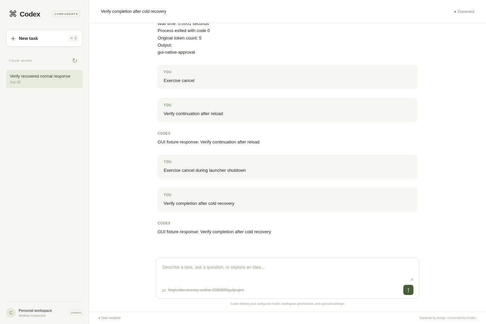

# Recovered cloud checkpoint — September 30, 2026

The original Linux cloud checkout and both saved worktrees were recovered. No
upstream reimport, reset, or replacement workspace was used. The primary checkout
is `/workspace/codex-harness-everythings-a-plugin`; isolated newer work remains
at `/workspace/codex-harness-next-components`. Their original local branches and
uncommitted edits are retained.

## Preservation and durability

Before recovery fixes, both complete source trees, untracked files, SDK/desktop
plugin, root plans, all verification evidence (including ignored logs), Git refs
bundle and binary patches were archived. The checkpoint also includes accepted
host/package artifacts and the SDK wheel. Generated caches were excluded; the
original files were preserved.

- Archive: `/workspace/recovery-backups/20260930T165936Z/codex-recovered-workspace.tar.zst`
- Size: 218,540,149 bytes; 18,792 verified archive entries.
- SHA-256: `3ed6902a915654787bcc6166fcd27da8c71feb0a186f180b5d98f823854e9cbd`
- [Integrity and scope report](verification/2026-09-30/recovery-full-workspace-backup.json)

This archive is **inside the same cloud filesystem**, not an externally uploaded
or proven user-downloadable backup. Source published to GitHub is independently
durable only after its remote refs are verified. Build caches, binaries, runtime
homes and credentials are excluded from source publication. The isolated newer
source must have its own clearly marked preservation branch; its older copied
reports do not prove that newer source works.

## Recovered runtime evidence

The exact accepted v2 CLI and component manager were fingerprinted before and
after the checks; neither executable changed. Native thread/attachment packages
had previously been built outside the checkout with exported source removed.
They were reinstalled into fresh recovery homes. The GUI package was freshly
built outside the source tree and installed after its external source was removed.

- [CLI/storage](verification/2026-09-30/recovery-runtime-summary.json): installed
  native thread storage, real engine/tool execution, context contribution,
  streamed response, persisted resume and native restoration passed.
- [Attachment storage](verification/2026-09-30/recovery-attachment-revalidated.json):
  5 MiB staged input, inline upload, resolve-not-found, removal and rejected use
  after removal passed. This recovery check targets the package; earlier engine
  attachment integration evidence remains separately recorded in VALIDATION.
- [Manager shutdown](verification/2026-09-30/recovery-manager-shutdown-acceptance.json):
  all three signal cases passed, including successful graceful exit and forced
  termination reporting uncertain durability.
- [Actual GUI/engine](verification/2026-09-30/recovery-gui-acceptance.json): streamed
  output, native command approval/execution, Stop, page reload, actual launcher
  Ctrl+C during a blocked turn, cold history recovery, subsequent completion and
  a second launcher Ctrl+C passed. All tracked children disappeared; both
  launcher exits were zero. Original observer mistakes remain in the browser log
  with their adjudication instead of being erased.

These runs use a deterministic independently packaged model or loopback provider
fixture. They exercise the real Codex engine and storage, but are **not live-model
inference proof**. Historical failing or superseded runs remain retained.

## Core regression and source identity

The first recovered complete core library run executed 2,694 tests: 2,690 passed,
four failed, exit 100. [Diagnosis](verification/2026-09-30/recovery-core-failure-analysis.md)
records the two ambient DNS/proxy fixture assumptions and two strict process
absence failures under this container's non-reaping PID 1.

Only two session test fixtures changed. Production behavior, security environment
and strict descendant-disappearance assertions remain unchanged. A tested Linux
subreaper wrapper supplies init-style orphan ownership and retains the real test
command exit status. The corrected complete rerun uses that wrapper.
Its [actual source manifest](verification/2026-09-30/recovery-core-lib-portable-20260930.source.json)
and tracked patch distinguish the tested source from the older frozen archive.
The final result is recorded in VALIDATION and its linked terminal report.

## GUI visibility

The managed environment reports no configured preview/forwarding capabilities,
and no supported forwarding tool is exposed. Its private loopback GUI URL cannot
be opened by a browser on the user's separate computer. The requested in-app
Browser checks could not run here; actual UI checks used Chromium via Playwright
inside the cloud worker. No public server or desktop infrastructure was added.

## Remaining scope

This checkpoint does not complete whole-harness compartmentalization. Native
thread storage and inline attachment handling have separate installable native
packages. Inference stream and credential resolve/refresh seams replace selected
implementations. Plugin infrastructure and the new GUI are distinct from those
native extractions. Full context/agent/policy/execution/configuration domains and
other boundaries remain open; staged unlinked code is not active functionality.

The complete upstream workspace suite remains blocked by this worker's disk
limit. Focused completed tests are evidence only for their stated scope. Platform
conformance and the known 4 MiB model-v1 frame limit remain unresolved. See
[COMPONENTS](COMPONENTS.md) and [VALIDATION](VALIDATION.md).
