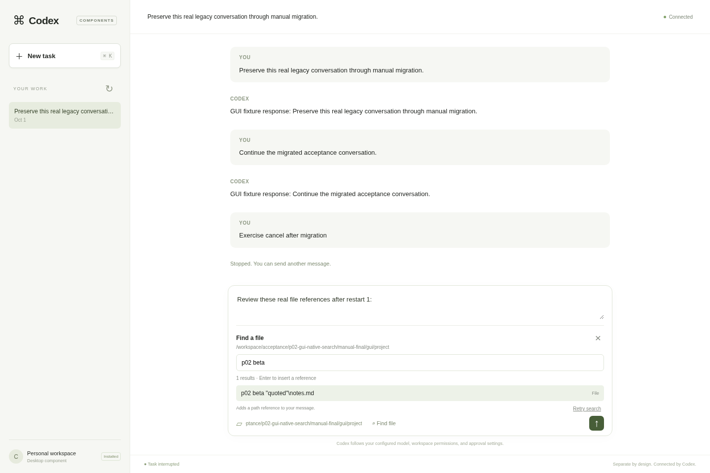
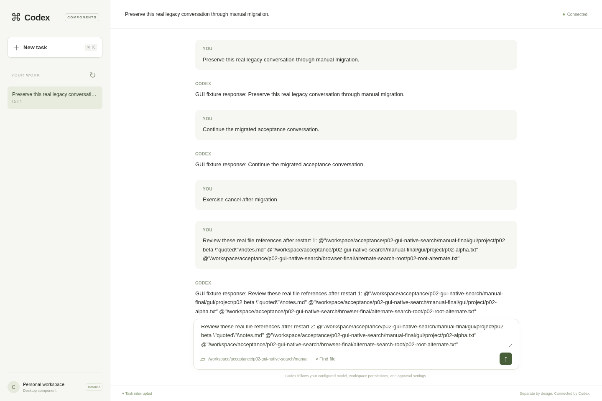

# P02 desktop file references: native-host acceptance

The separately packaged desktop component **0.2.0** passed real Chromium interaction with the frozen P01 Codex App Server, independently built native thread storage 0.2.0, and a deterministic model fixture. This is an additive client interaction through existing native `fuzzyFileSearch`, **not** proof that file search has been extracted into a selected component.

## Implemented interaction

`Find file` opens a keyboard and pointer accessible picker in the composer. Results come from the existing authenticated App Server RPC. Click or Enter inserts a consistently quoted full path reference while retaining unsent text. The UI describes this as a reference; it does not claim that file contents or attachments were sent.

Request ownership limits searches to one active request and the latest pending query. Unique per-page/per-query cancellation tokens and query/root/thread/connection generation checks prevent obsolete results from being displayed or inserted. Closing the picker, replacing the task, reconnecting, or changing the root invalidates prior results. RPC failures remain explicit errors. The gateway adds only the search method to its existing allowlist; token, origin, host and reply protections are retained.

The authenticated gateway reports its absolute default directory and host path syntax. Relative search roots show a helpful error before an RPC; the entered directory and unsent message remain unchanged. Linux behavior was exercised. Windows absolute-path syntax has unit coverage, with no claim of Windows runtime validation.

## Exact runtime and separate installation

- Codex CLI/App Server SHA-256: `467ee8360d45701bed728dead65568d6178b5b2d8c2c5b6d149ebcfb11a5ad01`.
- Component manager SHA-256: `acffaefb470b796b47f36fd9a9d5d4c23d2b5d3622316256b6c8c770ccc8a8f3`.
- GUI package `plugin.pyz` SHA-256: `930e2d5aefa5e644e9477e412526422f034baffc81e5d4aaef0ba37b0817a697`.
- Native storage package is the previously verified independent package at `/workspace/acceptance/thread-store-p01-0.2.0/package`; this gate reused it and did not rebuild native storage or either host binary.

The fixture copied GUI source outside the harness checkout, built the package there with the SDK, removed that external source, and installed through the normal component manager. The executed GUI source files were byte-compared with the current source and recorded in the JSON report. Both frozen binaries and all installed package files remained unchanged throughout the browser run.

Fresh final preparation: `/workspace/acceptance/p02-gui-native-search/manual-final`.
Fresh final browser run: `/workspace/acceptance/p02-gui-native-search/browser-final`.
Existing P01 homes, packages, and historic reports were not modified.

## Passing checks

Focused checks passed **7 Node controller/path-reference tests** and **14 Python desktop gateway and packaged lifecycle tests**. The opt-in acceptance flag `--exercise-file-search` defaults off, preserving the historic P01 runner behavior. The new helper's exact executed hash and the original runner backup hash are retained in the report.

Final browser cycle 1 passed **49/49 commands**; cold cycle 2 passed **38/38**. Both browsers closed, with zero page errors. Both cycles exercised:

- Real files with spaces, quotes and a literal Linux backslash; click and keyboard insertion, preserved unsent text, and Enter choosing a result without submitting a turn.
- Relative-root rejection without an RPC or silent directory change.
- A→B→A replacement with distinct query tokens; root replacement; explicit Escape close; task replacement. Test barriers delayed real HTTP responses fetched from the actual gateway and preserved their original bodies.
- A submitted real turn containing the inserted references and its streamed fixture response.
- Existing task history, partial response streaming, approval and actual native command completion, Stop and model-process reaping, reload, cold session recovery, and interrupted-turn recovery.

Both cycles terminated by **SIGINT sent only to the component manager's Launch command during a blocked active turn**. They exited 0 in approximately **0.265 s** and **0.266 s**. Every observed descendant was absent from `/proc`, including zombies, and each child-subreaper drain passed. Gateway close or direct App Server termination was not substituted for launcher shutdown.

The strengthened final run waited for the restored conversation before taking its final insertion screenshot. A prior corrected run also passed 49 + 38 commands; these are repeated checks, not additional distinct tests.

## Preserved failure and limits

The initial P02 browser run timed out while waiting for connection, before search interaction. A separate real-manager diagnostic found a caught `Illegal invocation` startup error: browser-native timer functions were stored and invoked with an invalid receiver. The controller now calls them through closures. The first run and diagnostic still shut down through manager SIGINT successfully. Their private artifacts and sanitized outcome remain preserved; they are not relabeled as passes.

The requested in-app Browser tool was unavailable. Validation used real Chromium through Playwright, plus visual inspection of the safe viewport screenshots. No live model provider, Windows GUI runtime, or selected search-provider plugin was exercised. Existing one-shot search cancellation remains best effort; these checks establish result fencing, not joined server-side search-session cleanup. Process scans can miss very short-lived children; the report states that limit alongside strict observed-process absence and child-subreaper results.

The public [JSON evidence](p02-gui-native-search-results.json) contains whitelisted outcomes and exact fingerprints. Raw logs, bearer URLs, browser error commands, private ready files and runtime state remain outside the source checkout.

