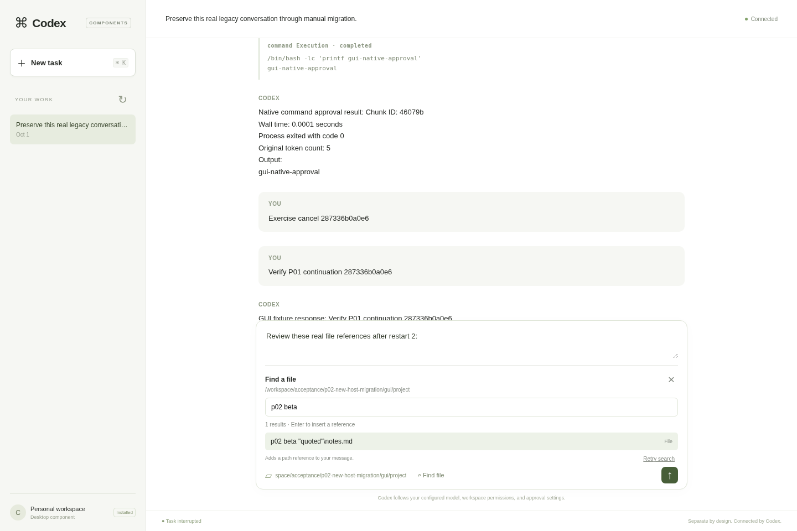
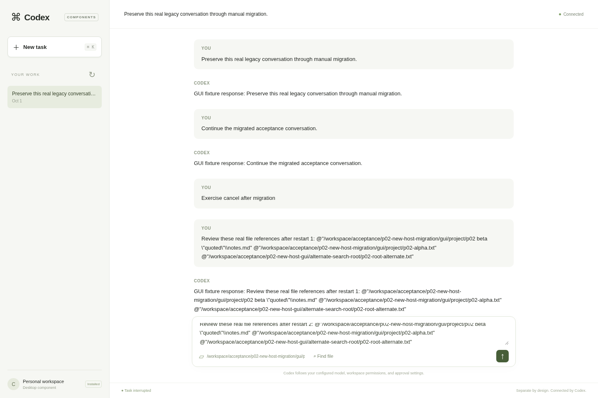

# P02 StageA: native file-search lifecycle and GUI verification

This checkpoint verifies native search ownership and cleanup, client result fencing, source packaging, and an additive desktop file picker. **Search is still native and coupled: independently installed search discovery, selection, replacement and removal are not implemented or verified.** This is a prerequisite to P02 extraction, not completion of it or of whole-harness compartmentalization.

## Source and implementation scope

OpenAI Codex is pinned to `d42056091aded7feb1d88ac7e83972108b2aa478`. The preceding published P01 checkpoint is `06d3540c73510120cd8a08a1d9d3429718bda9bf`. Verification used successive source scopes captured before and after each command; the final Rust source snapshot was preserved on WIP `17c366bb94f77b3d3895acd6f061a5cb308bd384`. Documentation baseline `4288e493d3164ef2995808c02cc65e60528ca96e` is not mislabeled as tested implementation. The verified StageA source checkpoint is `25b2c3150879761026086a62e480045fc38d32ff` (tree `5ba385b6e7730119b6d5cdca67fba2dc4f5c395d`). Exact before/after path mapping and publication context are recorded in [P02 lineage](../../upstream/p02-search-lineage.json).

The checkpoint changes these existing native paths:

- `codex-rs/file-search/src/`: the owner retains admitted startup and cleanup when callers abandon waiters, fences tagged queries, reports retained failures, and joins actual walker/matcher threads. Admission is bounded; a shutdown receipt represents completed native cleanup.
- `codex-rs/app-server/src/request_processors/search/` and connection/lifecycle integration: search sessions belong to their connection; publishers discard obsolete results; stop waits for native and publisher cleanup before its reply; disconnect and shutdown fence further publication.
- `codex-rs/tui/src/`: one outer owner spans `App::run`; manager/session/query identities fence queued results. Reconnect updates the event channel while retaining the runtime owner. The regression checks the actual old and new receivers and release of old senders after cleanup.
- `codex-rs/third-party/nucleo/`: a supplied pool and shutdown/quiescence boundary allow the native owner to retain and join worker threads. Nucleo is pinned to `4253de9faabb4e5c6d81d946a5e35a90f87347ee` (Nucleo 0.5.0 / Matcher 0.3.1, **MPL-2.0**). Licenses and provenance are retained.

SDK source export now preserves nested workspace ownership and covered-source notices. The separately packaged desktop component 0.2.0 adds authenticated native `fuzzyFileSearch` results, quoted path-reference insertion, and query/root/task/connection fences. References are not uploaded file contents or attachments. Token, origin, host and response protections remain enabled.

Unregistered `codex-rs/file-search-api/` and `codex-rs/component-path-codec/` drafts are preserved on WIP but **excluded from this accepted StageA checkpoint**. They were not compiled into the verified engine.

## Focused and regression results

| Gate | Observed result | Scope |
| --- | --- | --- |
| Native search | **35/35 passed**, 0 skipped | Latest corrected startup/lifecycle run; scoped source unchanged, subprocess and subreaper exit 0. |
| Vendored Nucleo and Matcher | **35/35 passed**, 0 skipped | Separate library tests, including supplied-pool/shutdown coverage; not the native crate's 35 tests. |
| App Server library | **395/395 passed**, 0 skipped | Unchanged scoped source. Focused **27/27** search/lifecycle tests are a subset, not 27 additional cases. |
| App Server public RPC | **12/12 passed** plus corrected WebSocket **1/1 passed** | Real one-shot/session RPC and separate connection-isolation case. **13 distinct cases across two runs**, not one aggregate run. Scoped source unchanged in each passing run. |
| Current TUI search/reconnect | **11/11 passed**, 5,601 filtered | Real old/new event-channel regression; source unchanged. Included in the broader TUI scope. |
| Full TUI library | **5,608 executed: 5,604 passed, 4 failed; 4 ignored** | Exit 100 under ambient `NO_COLOR`. Only two generated `.snap.new` outputs changed; production, tests and approved snapshots did not. |
| Cursor environment rerun | **6/6 passed**, 5,606 filtered | Same executable and unchanged tests/snapshots, with `NO_COLOR` removed only for the child command; includes all four failed cases. |
| Rust SDK packaging | **19/19 Python passed** | Exporter/assembler, nested owner retention and covered-source fidelity. No independent search package build. |
| Desktop controller/gateway | **7 Node + 14 Python passed** | Controller/path-reference behavior and gateway/packaged lifecycle regression. |
| Formatting and lint | Scoped `just fix`, `just fmt`, final scoped `just clippy`: **exit 0** | Final Clippy source unchanged, no owned-crate warnings; eight vendor style warnings remain. |
| Bazel dependency graph | Corrected lock update, target and direct-dependency queries completed | Graph validation only; no Bazel compilation or test claim. |
| Current CLI build | **Exit 0; 2,979 source fingerprints unchanged** | One source build of the current engine, followed by separately verified stripping. |

The full TUI run and unchanged cursor rerun establish **5,608 distinct executed cases with a pass across the two environments**. There was no single all-green aggregate TUI run; four ignored tests remain unexecuted. Do not sum overlapping or repeated rows. Exact commands, source/log fingerprints, subset checks and retained failures are in [the scoped evidence manifest](p02-search-prerequisite-evidence.json).

An earlier 11-test TUI search run used an earlier snapshot: four test files changed while it ran (`app-server/src/in_process_lifecycle_tests.rs`, `app-server/src/request_processors/search/search_tests.rs`, `app-server/src/request_serialization_search_tests.rs`, `file-search/src/async_owner_tests.rs`). Its manifest correctly reports that broad scope as changed. It does not stand in for the later unchanged-source reconnect run.

## Real runtime with the new engine

[New-host runtime evidence](p02-new-host-runtime-results.json) records the current engine separately from the [historical frozen-P01 GUI evidence](P02_GUI_NATIVE_SEARCH_EVIDENCE.md).

| Executed artifact | SHA-256 |
| --- | --- |
| Current stripped Codex CLI/App Server | `181463925d599f0eed023106820cad8fbb228d81e972eefb256a2076b88813c0` |
| Unchanged P01 component manager | `acffaefb470b796b47f36fd9a9d5d4c23d2b5d3622316256b6c8c770ccc8a8f3` |
| Reused independently built native storage 0.2.0 worker | `0e691de19cf3239f702e384b7c483ecfcf1b72ba5711e196103160427cba0f99` |
| Separately packaged GUI `plugin.pyz` for this new-host run | `a095f2a6ffa9fdceae69d00197868cc14f5eb0a1ce1fb89adbeba9ae8cdd02f4` |

The original unstripped CLI hash was `7eadbfd1cc110dc2f49fa81a652ea6ef9de5f8e735471b35347fda4f1115ba2d`. All **30 allocated ELF sections** were compared before/after stripping and matched. The original generated cache aliases were subsequently removed under the recorded cache-preservation audit; the separate executed candidate and its original metadata remain preserved. Stripping was not another source build. The candidate metadata's pending status records its creation time, before these completed runtime gates.

The unchanged native storage 0.2.0 package passed real compatibility with the new host: CLI turns, external tool execution, streaming, cold resume, native restoration with retained history, and termination of all three observed storage children. The report explicitly uses `evidence_kind: reused_package_new_host` and `new_independent_build: false`. Its independent native build proof belongs to the original P01 report; no second native storage build is claimed.

Manual migration passed against the new host: a real legacy conversation; native/selected dry-run parity with unchanged storage bytes; selected apply and repeated idempotent apply; cold CLI and App Server recovery; cancellation and reaping. All six recorded storage-worker PIDs were absent at verification. The storage and migration subreaper wrappers exited 0 without runner errors.

The new-host GUI passed **49/49 commands followed by 38/38 in a cold cycle**, with zero page errors and both browsers closed. It exercised:

- Real native file results with spaces, quotes and a literal Linux backslash; click and keyboard insertion; preservation of unsent input; Enter choosing a result without submitting a turn.
- Relative-root rejection before RPC; A→B→A query identities; root/task/close fences. Delays held actual fetched replies and preserved their original bodies.
- Submitted path references through a real Codex turn, streamed responses, native command approval and completion, Stop, reload and cold conversation recovery.
- **SIGINT sent only to the component manager's Launch command during an active blocked turn**. The two launches exited 0 in approximately **0.315 s** and **0.316 s**. Every observed manager, gateway, App Server, storage, model and browser descendant was absent from `/proc`; per-cycle and final child-subreaper drains passed. Direct gateway or App Server shutdown was not substituted.

Current CLI/manager binaries and installed package files remained unchanged. Each storage, migration and GUI runner recorded **60 unchanged source fingerprints before and after**; these are source-scope counts, not additional test counts. The 87 GUI commands repeat the earlier P01 interaction cases against a new engine, not 87 new distinct features. The earlier P01 run had its own frozen CLI/package hashes and shutdown timings (approximately 0.265 s and 0.266 s); its evidence remains unchanged.

## Original failures and corrections retained

- The full TUI run failed four cursor color cases, including their retries, under ambient `NO_COLOR`. Pinned Crossterm 0.29.0 suppresses ANSI color for this setting. Six unchanged cursor tests passed with the same executable when that variable was removed only for the child command. Both generated failed snapshots remain preserved in the recovery backup; no approved snapshot was changed to mask the failures.
- The first App Server focused compilation failed before tests with `No space left on device` (exit 101). Scoped cache recovery preceded the passing unchanged-source 27-test retry and full 395-test library run.
- The initial Bazel lock update could not resolve nested `nucleo-matcher`. A root path patch corrected dependency discovery; the subsequent lock update and graph queries completed. The original failed log remains.
- An early native build imported `TaskTrackerToken` from an unavailable pinned `tokio-util` path. Its corrected implementation later passed. A subsequent 33/34 native run incorrectly expected a final match in an initial partial snapshot; the corrected fixture waits for tagged completion/final results. The latest native run passed 35/35.
- An attempted native run omitted the subreaper's required `--report` and ran no tests. It is retained separately from the correctly invoked passing run.
- The first GUI attempt failed during startup with caught `Illegal invocation`: native browser timers had been called with the controller as receiver. Calling them through closures fixed startup. The failed run, diagnostic and graceful cleanup remain preserved in the historical GUI report.
- Read-only review exposed reconnect coverage missing from the earlier single-channel TUI test. The source fix and actual old/new receiver test passed in the current 11-test run.
- The new WebSocket isolation test failed twice because it had not consumed the valid initial empty-query snapshot. Only the fixture changed: it validates startup response, empty snapshot and completion before typed queries. Strict isolation and post-stop assertions stayed enabled; the corrected separate case passed.
- `just fix` proposed an invalid automatic `PathBuf == str` rewrite; it was rejected/restored. Equivalent manual lint cleanups and formatting were followed by successful scoped Clippy. Eight vendor style warnings remain (two Matcher lifetime syntax and six Nucleo parenthesis warnings); one copied constructor annotation may be new. No warning-free or all-warnings-inherited claim is made. Formatting/lint-only changes did not trigger redundant test reruns.

## Evidence custody and remaining limits

The [final Nucleo source audit](p02-nucleo-source-audit.json) records 36 files: 30 unchanged at the pinned upstream Git blobs, three modified, two added, and one license symlink materialized with the exact parent license text. Its SHA-256 is `d5862ff6ab1bdb7654638937166b19fbfc20bb7ea4f1891f8631fdf19149276b`. The source packaging check is not a complete transitive-license or independently built search-package certification.

Public manifests contain whitelisted results, paths and hashes. Raw runtime/browser reports, bearer URLs, ready-file contents, credentials and session state remain outside the checkout. Original logs are retained under `/workspace/acceptance/` and `/workspace/recovery-backups/20260930T165936Z/`; the public records identify their exact bytes without publishing private contents. Cloud-local archives are recovery checkpoints, not proven external backups. Published Git refs protect only their included source.

The requested **in-app Browser was unavailable**. Real Chromium through Playwright and visual inspection of safe viewport screenshots were used. Inference used deterministic fixtures through the real Codex engine, not a live provider. Linux runtime was exercised; Windows path syntax has unit coverage only. Process scans can miss very short-lived children, so process claims are limited to observed identities plus successful subreaper drains. GUI one-shot search cancellation is still best effort; these browser gates establish result fencing, not joined ownership of that server-side operation.

P02 still requires its registered neutral API, bounded native and process backends, shared composition, discoverable worker package, compatibility/failure policy, and external-build installation/removal/replacement tests against an unchanged host. The rest of the harness extraction and the required upstream update workflow remain governed by the [canonical roadmap](../../IMPLEMENTATION_ROADMAP.md).
